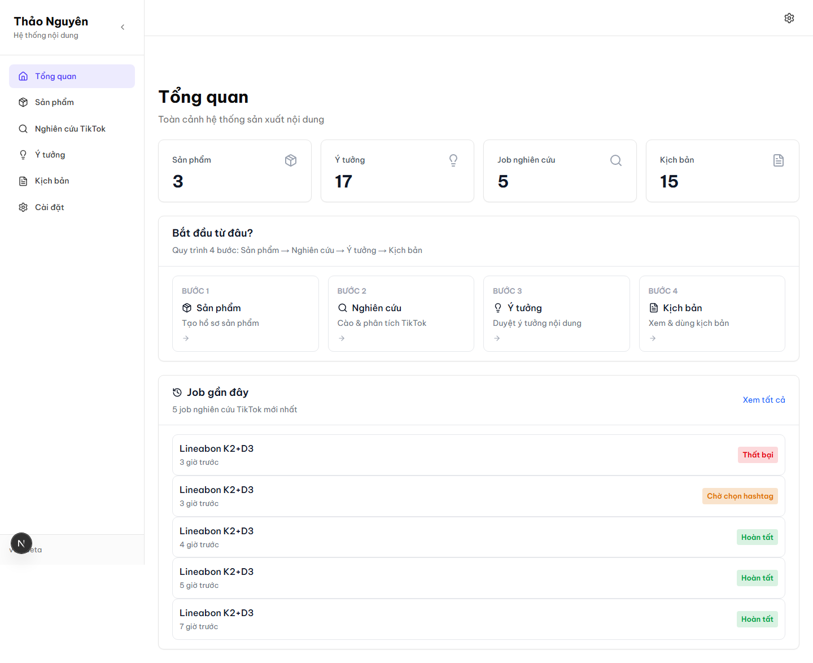
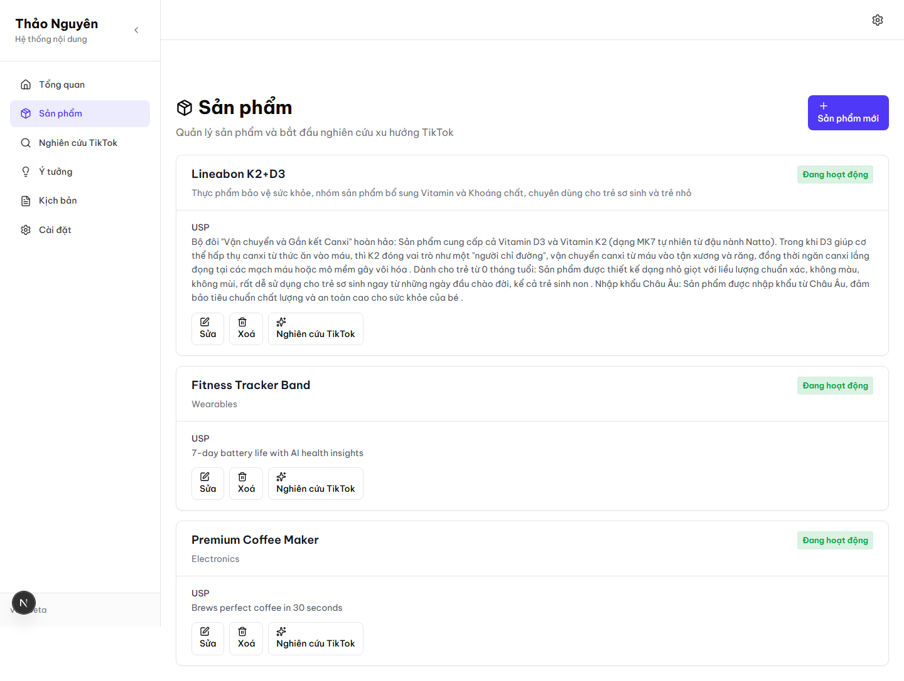
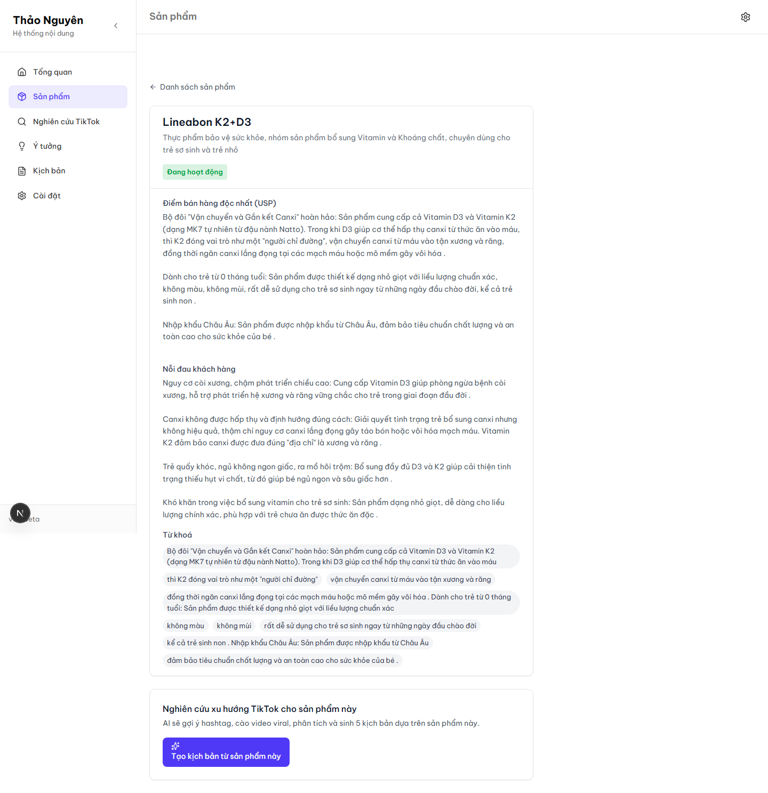
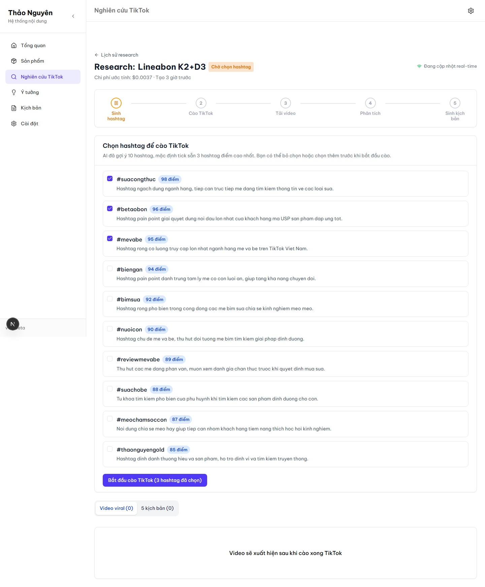
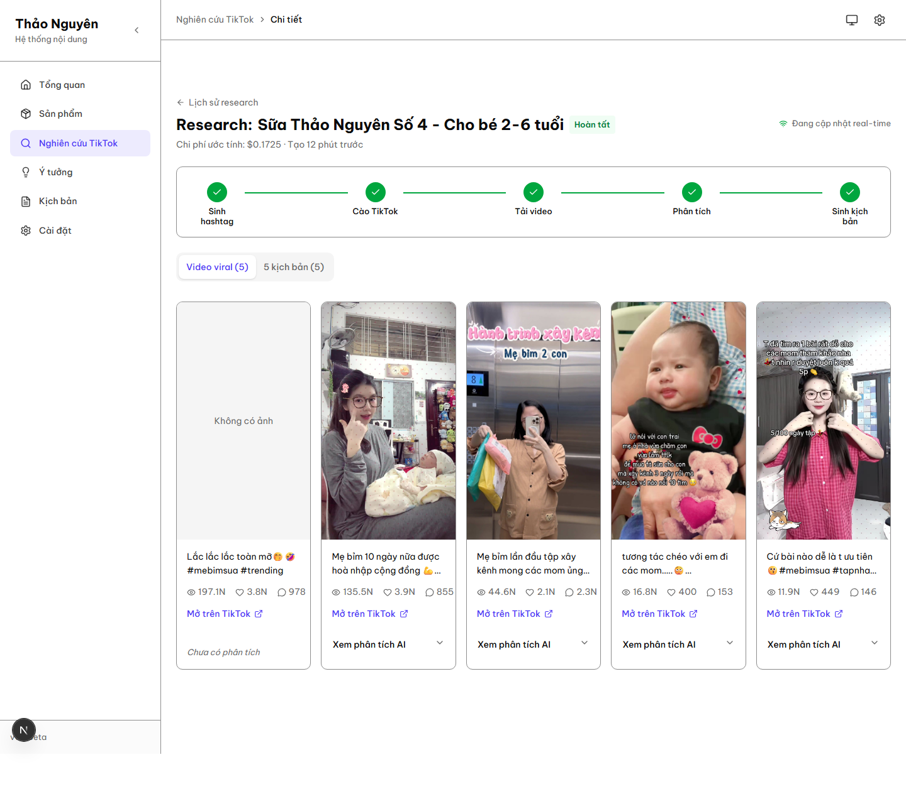
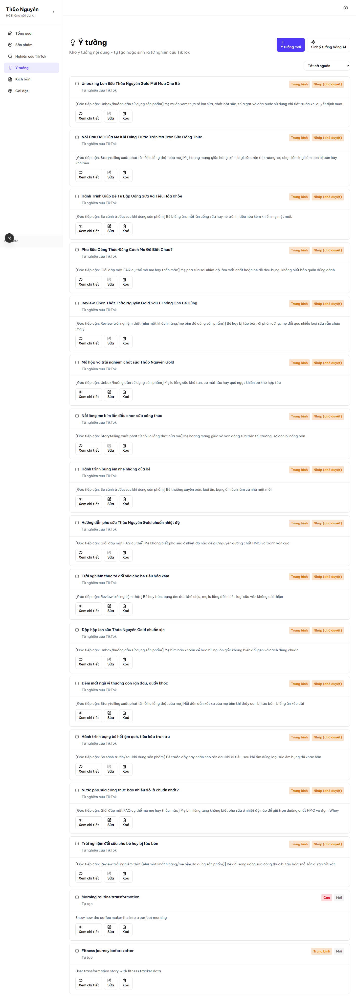
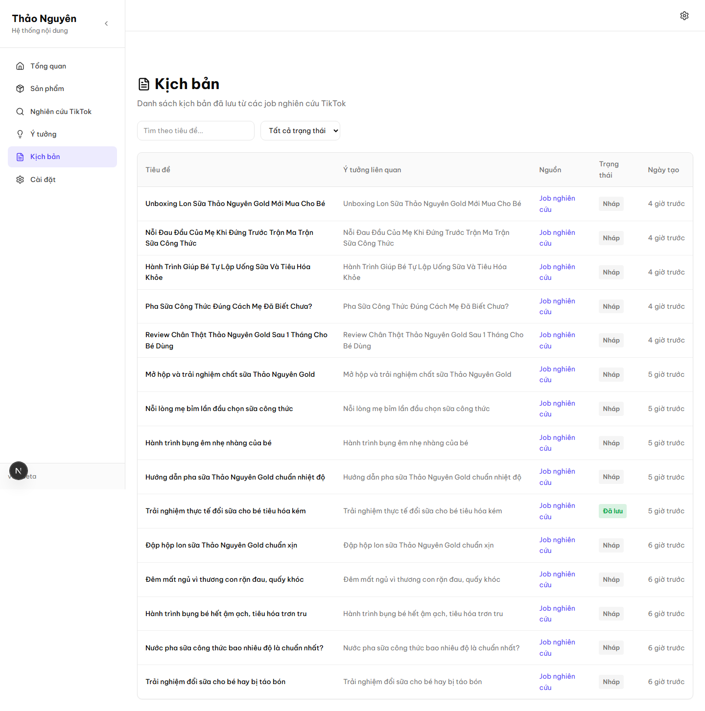
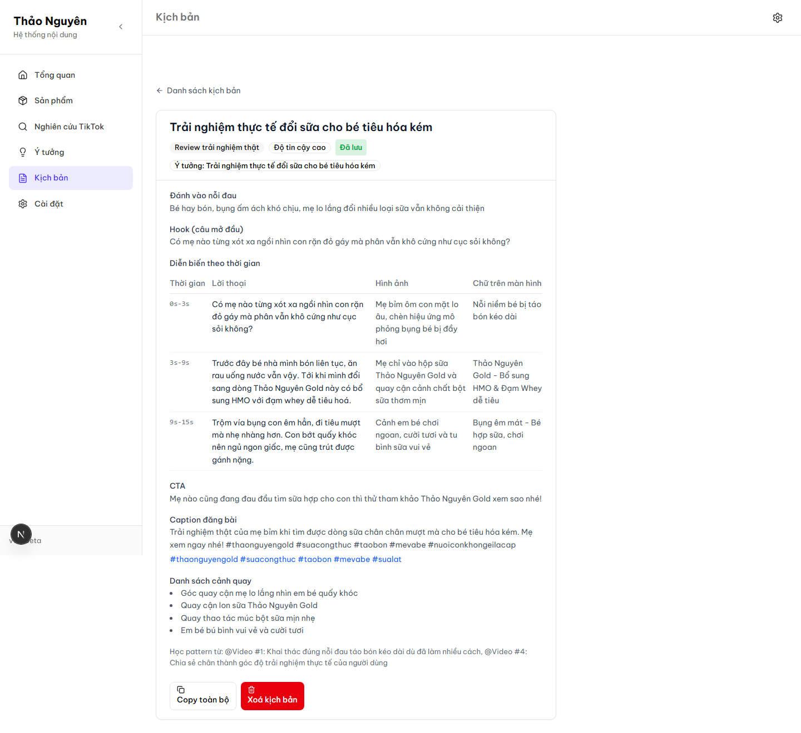
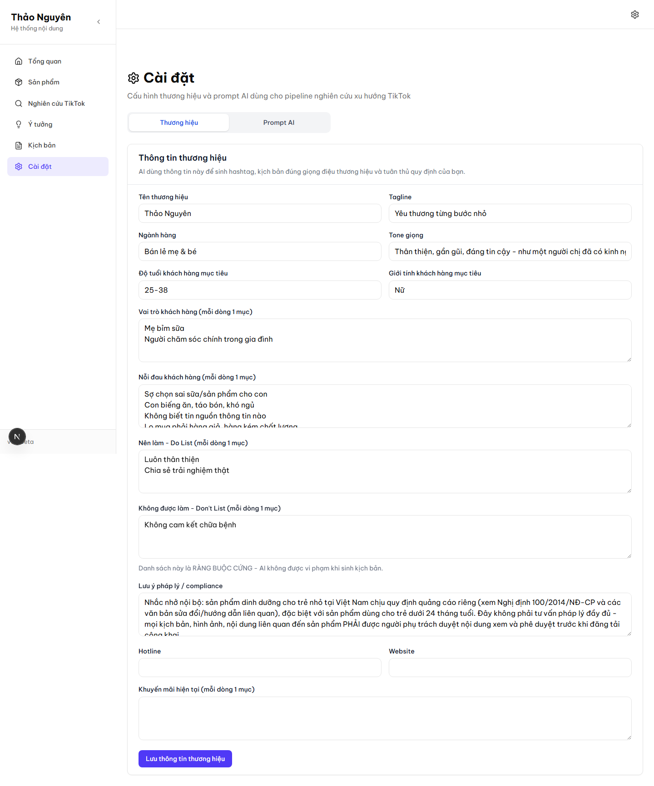

# Hướng dẫn sử dụng CMS Thảo Nguyên

Tài liệu này viết cho người **không biết code**, dùng CMS hằng ngày để tạo
kịch bản TikTok cho các sản phẩm sữa/dinh dưỡng của Thảo Nguyên. Mọi ảnh chụp
màn hình dưới đây là **ảnh thật** từ hệ thống đang chạy, không phải mô phỏng.

## 1. Tổng quan giao diện

Bên trái là menu điều hướng chính:
- **Sản phẩm** - nơi khai báo thông tin sản phẩm để AI dùng làm ngữ cảnh
- **Nghiên cứu TikTok** - nơi bắt đầu và theo dõi các job nghiên cứu AI
- **Ý tưởng** - danh sách ý tưởng nội dung (tự sinh + tự thêm tay)
- **Kịch bản** - danh sách kịch bản hoàn chỉnh, sẵn sàng để quay
- **Cài đặt** - thông tin thương hiệu và "công thức" (prompt) AI dùng để sinh nội dung

Góc trên bên phải có nút chuyển đổi **Sáng / Tối / Theo hệ thống** - chọn theo
sở thích, không ảnh hưởng đến dữ liệu.

## 2. Thêm sản phẩm mới

Bấm **"Thêm sản phẩm"**, điền các trường:
- **Tên sản phẩm, Ngành hàng, USP** (điểm bán hàng độc nhất) - bắt buộc
- **Nỗi đau khách hàng, FAQ, Bằng chứng xã hội, So sánh, Gợi ý quay/chụp** - càng chi tiết, AI sinh nội dung càng sát thực tế
- **Độ tuổi phù hợp** - BẮT BUỘC chọn đúng 1 trong 3:
  - *Dưới 24 tháng tuổi* - sản phẩm dành cho trẻ sơ sinh/nhũ nhi. **Chọn mục
    này sẽ khiến hệ thống KHÔNG cho tạo nghiên cứu AI tự động** cho sản phẩm
    này (xem mục 3b) - đây là quy định pháp lý, không phải lỗi.
  - *Từ 24 tháng tuổi trở lên* - sản phẩm cho trẻ lớn hơn, chạy AI bình thường.
  - *Không áp dụng* - sản phẩm không phải sữa/dinh dưỡng trẻ nhỏ.

## 3. Tạo nghiên cứu TikTok

Vào trang chi tiết sản phẩm, bấm **"Tạo kịch bản từ sản phẩm này"**.

### 3a. Nếu sản phẩm hợp lệ (24 tháng+ hoặc không áp dụng)

Hệ thống xác nhận lại (thao tác này tốn chi phí AI/scraping thật), bấm
**"Bắt đầu"** để tạo job nghiên cứu.

### 3b. Nếu sản phẩm là "Dưới 24 tháng tuổi"

Hệ thống sẽ **chặn lại** và hiện 1 khung thông báo màu xanh dương giải thích
lý do (không phải lỗi đỏ) - sản phẩm dinh dưỡng cho trẻ dưới 24 tháng chịu quy
định quảng cáo riêng theo Nghị định 100/2014/NĐ-CP, cần người phụ trách tuân
thủ xem và duyệt nội dung thủ công trước, hệ thống chưa hỗ trợ chạy AI tự động
cho nhóm sản phẩm này. Đây là tính năng bảo vệ có chủ đích, không cần báo lỗi.

## 4. Chọn hashtag

Sau vài giây, hệ thống AI gợi ý khoảng 10 hashtag kèm điểm phù hợp và lý do.
**Chọn 1-2 hashtag phù hợp nhất** rồi bấm xác nhận để tiếp tục - **không nên
chọn quá nhiều hashtag** vì mỗi hashtag làm tăng chi phí cào dữ liệu TikTok
(xem `docs/COSTS.md` nếu cần hiểu chi tiết chi phí).

## 5. Theo dõi tiến trình

Thanh tiến trình 5 bước cập nhật **theo thời gian thực** (không cần bấm làm
mới trang): Sinh hashtag → Cào TikTok → Tải video → Phân tích → Sinh kịch bản.
Toàn bộ mất khoảng **5-10 phút**. Có thể đóng tab và quay lại sau, tiến trình
vẫn được lưu và tiếp tục hiển thị đúng khi mở lại.

Nếu 1 video nào đó không phân tích được (video lỗi/quá dài), hệ thống tự động
bỏ qua và tiếp tục với các video còn lại - card của video đó sẽ hiện "Chưa có
phân tích" thay vì làm hỏng cả job.

## 6. Xem kết quả

Khi job hoàn tất, 5 ý tưởng + 5 kịch bản xuất hiện tự động ở trang **Ý
tưởng** và **Kịch bản** - mỗi kịch bản theo 1 góc tiếp cận khác nhau (review
trải nghiệm thật, giải đáp FAQ, chia sẻ cảm nhận, storytelling, hướng dẫn sử
dụng) để không bị trùng lặp nội dung.

## 7. Xem chi tiết kịch bản + cảnh báo tuân thủ

Mở 1 kịch bản để xem đầy đủ: hook, diễn biến theo thời gian (lời thoại/hình
ảnh/chữ trên màn hình), CTA, caption, hashtag đề xuất.

**Nếu kịch bản có cụm từ bị hệ thống cảnh báo** (vd nhắc đến "chữa bệnh",
"thay thế sữa mẹ" hoặc các cụm nằm trong danh sách cấm của thương hiệu), sẽ có
khung cảnh báo màu đỏ ở đầu trang liệt kê rõ cụm từ, và chính cụm từ đó được
**bôi đỏ trực tiếp** trong nội dung kịch bản.

> **Quan trọng**: đây chỉ là lớp lọc sơ bộ theo từ khoá, **không thay thế**
> việc người phụ trách đọc lại toàn bộ kịch bản trước khi đăng. Một số cách
> diễn đạt gián tiếp (vd "trộm vía con đi ngoài dễ dàng" ngụ ý hiệu quả sức
> khỏe mà không dùng từ khoá bị cấm) sẽ **không** được hệ thống tự động phát
> hiện - luôn đọc kỹ bằng mắt trước khi đăng bất kỳ kịch bản nào.

Kịch bản có thể **Copy toàn bộ** để dán sang công cụ khác, hoặc **Xoá** nếu
không dùng.

## 8. Cài đặt thương hiệu

Ở trang **Cài đặt**, có thể sửa:
- **Thông tin thương hiệu**: tên, tông giọng, danh sách "phải làm" (doList) và
  "không được làm" (dontList) - AI sẽ tuân theo khi sinh kịch bản.
- **Công thức AI (prompt template)**: nội dung hướng dẫn chi tiết AI cách viết
  kịch bản. Nếu phát hiện kịch bản AI sinh ra có vấn đề lặp lại (vd hay dùng 1
  kiểu câu không phù hợp), sửa trực tiếp ở đây - **áp dụng ngay cho mọi lần
  sinh kịch bản sau đó**, không cần sửa tay từng kịch bản một.

## Câu hỏi thường gặp

**Bấm "Tạo kịch bản" 2 lần liên tiếp có sao không?**
Không - hệ thống tự động chặn tạo job thứ 2 cho cùng sản phẩm nếu job đầu
chưa xong, hiện thông báo rõ ràng thay vì âm thầm tốn tiền 2 lần.

**Job bị lỗi (trạng thái "Thất bại") thì làm sao?**
Xem thông báo lỗi hiển thị trên trang - thường là hết hạn mức AI trong ngày,
hoặc TikTok không trả về video nào cho hashtag đã chọn. Có thể bấm **"Thử
lại"** để chạy lại - hệ thống sẽ tiếp tục từ đúng bước bị lỗi, không tính
tiền lại cho các bước đã xong trước đó.

**Tại sao thấy thông báo "vượt trần chi phí/ngày"?**
Hệ thống có giới hạn chi phí AI/scraping mỗi ngày để tránh phát sinh chi phí
ngoài kiểm soát. Nếu cần tăng giới hạn, liên hệ người quản trị hệ thống (xem
`docs/COSTS.md`).
